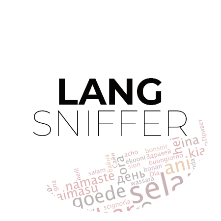
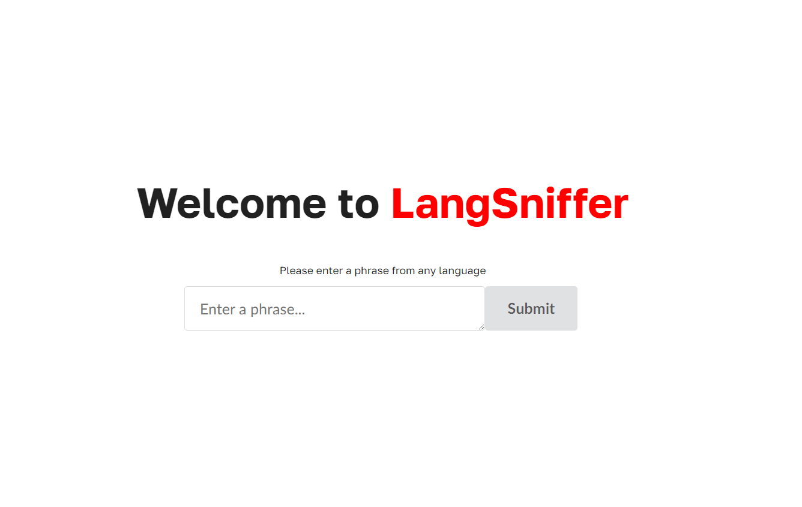
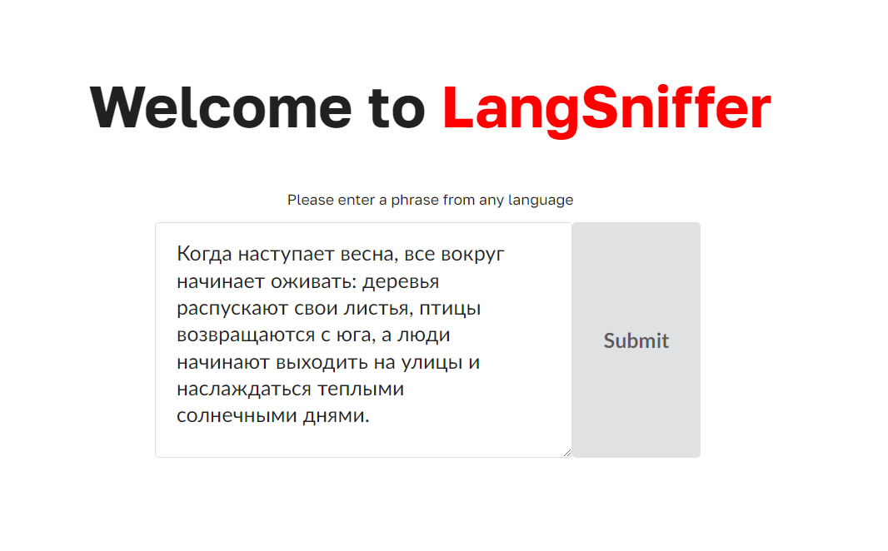
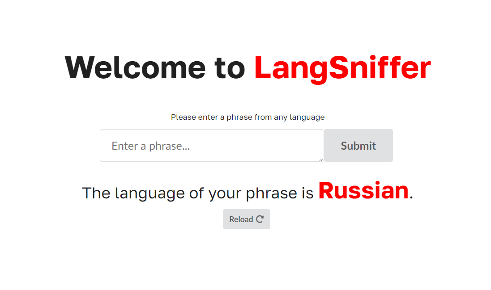
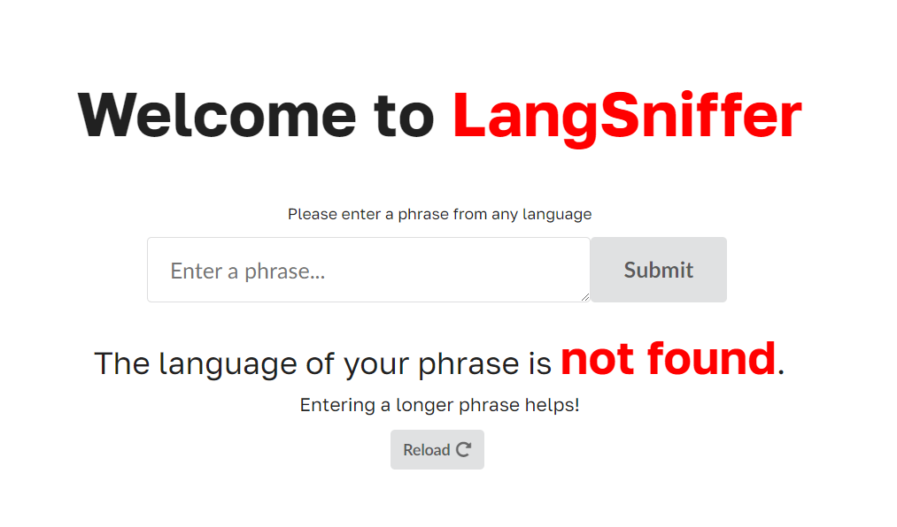

 

  

  <h3 align="center">LangSniffer</h3>

  

    Detect Language in an Instant. 
  

## About The Project

LangSniffer is a powerful web application that can detect the language of any given phrase or text in an instant. With the ability to identify over 70 different languages, LangSniffer is a valuable tool for anyone who needs to work with multilingual content.

## Built With
* [![JavaScript][JavaScript.com]][JavaScript-url]
* [![Node][Node.com]][Node-url]
* [![ExpressJS][ExpressJS.com]][ExpressJS-url]

## Design
  

    
  

  

    
  

    

    
  

[JavaScript.com]: https://img.shields.io/badge/JavaScript-323330?style=for-the-badge&logo=javascript&logoColor=F7DF1E
[JavaScript-url]: https://en.wikipedia.org/wiki/JSX_(JavaScript)
[Node.com]: https://img.shields.io/badge/node.js-6DA55F?style=for-the-badge&logo=node.js&logoColor=white
[Node-url]: https://nodejs.org/en
[ExpressJS.com]: https://img.shields.io/badge/express.js-%23404d59.svg?style=for-the-badge&logo=express&logoColor=%2361DAFB
[ExpressJS-url]: https://expressjs.com/
